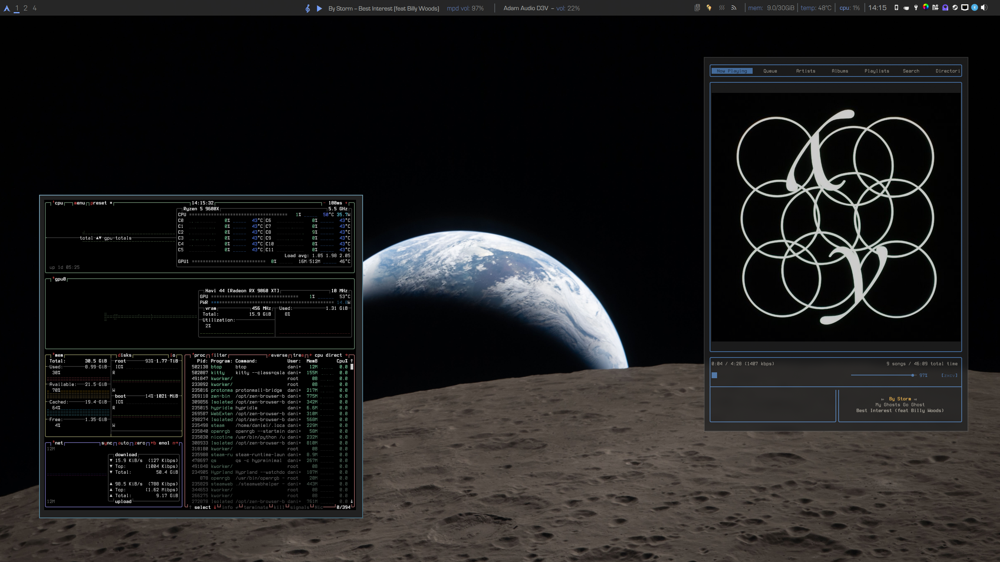

# hyprminimal

A minimal, oled-friendly auto-hiding topbar for [Hyprland](https://hyprland.org/), built with [Quickshell](https://quickshell.outfoxxed.me/).

The bar hides until you hover the top edge of the screen (or trigger it via IPC), keeping your desktop uncluttered and preventing oled burn-in.



---

## Features

- Auto-hide with hover-reveal and IPC trigger
- Hyprland workspace switcher
- Media player info + play/pause (via `playerctl`, with MPD volume control)
- Pipewire audio sink switcher + volume control
- CPU, memory, and temperature readout
- System tray
- Clock (click to toggle short/long format)
- Configurable toggle buttons (e.g. smart-home devices, remote scripts via SSH)
- Battery widget (laptop-friendly) (NB: Not very regularily tested, your mileage may vary)

---

## Dependencies

### Required

| Package | Purpose |
|---|---|
| [Quickshell](https://quickshell.outfoxxed.me/) | Shell framework (QML-based) |
| Hyprland | Window manager |
| Pipewire | Audio (sink detection + volume) |
| `playerctl` | Media player control |
| `free` (procps) | Memory readout |
| `upower` | Battery status |
| `bc` | Temperature conversion in `hwmonscript.sh` |

### Optional but expected by default config

| Package | Purpose | Config key |
|---|---|---|
| `rofi` + `rofi-power-menu` | App launcher & power menu | `launcherCmd`, `powerMenuCmd` |
| `pavucontrol` | Audio control GUI (right-click audio widget) | `audioControlCmd` |
| `btop` | Resource monitor (click CPU widget) | `resourceMonitorCmd` |
| `fastfetch` | System info (left-click logo) | `fetchCmd` |
| `rmpc` | MPD client | `musicPlayerCmd`, `musicPlayerCmdRemote` |
| `fluent-reader` | RSS reader | `rssCmd` |
| the fonts `Nudistar` and `Eurostile`|
| A [Nerd Font](https://www.nerdfonts.com/) | Icons throughout the bar | `font1` / `font2` / `font3` |

All optional dependencies can be swapped out by editing `Config.qml`.

---

## Fonts

The default config uses **Eurostile** and **Nudista Light** (commercial fonts). Its easy to find free versions of the files with a quick web-search. You can also replace them with any fonts you have installed — set `font1` and `font2` in `Config.qml`.

Icon glyphs require a Nerd Font. `font3` defaults to `GohuFont 14 Nerd Font Mono` but any Nerd Font works. If your primary font already includes Nerd Font glyphs you can leave `font3` as a fallback.

---

## Installation

1. Install Quickshell (see [quickshell.outfoxxed.me](https://quickshell.outfoxxed.me/)).

2. Clone this repo into your Quickshell config directory:

```sh
git clone https://github.com/yourusername/hyprminimal \
    ~/.config/quickshell/hyprminimal
```

3. Copy and edit the config:

```sh
# No copy needed — just open Config.qml directly
$EDITOR ~/.config/quickshell/hyprminimal/Config.qml
```

4. Launch:

```sh
quickshell -p ~/.config/quickshell/hyprminimal
```

To start it with Hyprland, add to `hyprland.conf`:

```
exec-once = quickshell -p ~/.config/quickshell/hyprminimal
```

---


## Hyprland configuration

Add the following to your `hyprland.conf`.

**Autostart** — launch the bar on login:

```sh
exec-once = qs -c hyprminimal
```

**Keybinds** — the bar is designed to be triggered by the Super key rather than always visible. Bind show/hide to Super press/release, and pin to Super+P:

```sh
# Show bar on Super press
bind  = , Super_L, exec, qs -c hyprminimal ipc call panelshow showPanel

# Hide bar on Super release
bindr = , Super_L, exec, qs -c hyprminimal ipc call panelshow hidePanel

# Toggle pin (keeps bar visible, prevents auto-hide)
bind  = Super_L, p, exec, qs -c hyprminimal ipc call panelshow pinPanel
```

The bar also reveals itself on hover — mouse to the top edge of the screen to show it without using the keyboard.

---


## Configuration

**All user-facing settings live in `Config.qml`.** You should not need to edit any other file for a standard setup.

### Appearance

```qml
property string font1:     "Eurostile"        // heading font
property string font2:     "Nudista Light"    // label font
property int    fontSize1: 18
property int    fontSize2: 16
property real   barOpacity: 0.8
property color  color1:    "#F0C674"          // accent (active states)
property color  color2:    "#7aa3fa"          // secondary accent
property color  foreground: "#C5C8C6"
```

### Commands

```qml
property string terminal:           "kitty -e "
property string launcherCmd:        "rofi -show drun -location 1"
property string powerMenuCmd:       "rofi -show power-menu -modi power-menu:rofi-power-menu -location 1"
property string audioControlCmd:    "pavucontrol"
property string resourceMonitorCmd: terminal + "btop"
property string musicPlayerCmd:     terminal + "rmpc"
```

### Toggle buttons

The bar includes a strip of up to three custom toggle buttons. Each button reads a state file (`0` = off, `1` = on) and runs a script on click. Scripts can run locally or on a remote machine over SSH.

```qml
// Example: a smart speaker toggle
property bool   btn1Enabled:      true
property string btn1Icon:         " 󰴸 "
property string btn1StateFile:    "/home/you/ipc/speaker_state" //reads a plain text file, and expects either a 1 or a 0
property string btn1ToggleScript: "/home/you/scripts/speaker_toggle.sh"

// Remote SSH (leave remoteHost empty to run scripts locally)
property string remoteHost: "192.168.1.100"
property int    remotePort: 22
property string remoteUser: "you"
property string btn1RemoteScript: "/home/you/scripts/speaker.sh"
property string btn1RemoteState:  "/home/you/ipc/speaker_state"
```

Set `btn1Enabled: false` (or `btn2Enabled`, `btn3Enabled`) to hide buttons you don't use.

### Bar behaviour

```qml
property int barHeight:    40    // bar height in px
property int hideDelayMs: 300   // ms before bar hides after cursor leaves
property int exitTimerMs: 3000  // ms before bar auto-hides after IPC show
```

---

## IPC

The bar can be shown/hidden/pinned from other scripts using Quickshell's IPC:

```sh
# Show the bar (auto-hides after exitTimerMs)
quickshell ipc call panelshow showPanel

# Hide the bar
quickshell ipc call panelshow hidePanel

# Toggle pin (prevents auto-hide)
quickshell ipc call panelshow pinPanel
```

---

## Temperature sensor detection

`hwmonscript.sh` reads from `/sys/class/hwmon/` and averages temperatures from sensors whose name contains `CPU`, `core`, or `temp`. If your CPU sensors aren't detected, check sensor names with:

```sh
for d in /sys/class/hwmon/hwmon*; do echo "$d: $(cat $d/name)"; done
```

Then adjust the pattern in `elements/hwmonscript.sh` if needed.

---


## AI disclosure

All code in this project was written by hand. [Claude](https://claude.ai) was used to assist with the GitHub release preparation — specifically extracting hardcoded user-specific values into `Config.qml`, refactoring `elements_Buttons.qml` to use it, and writing this README.

---

## License
GPL-3.0
